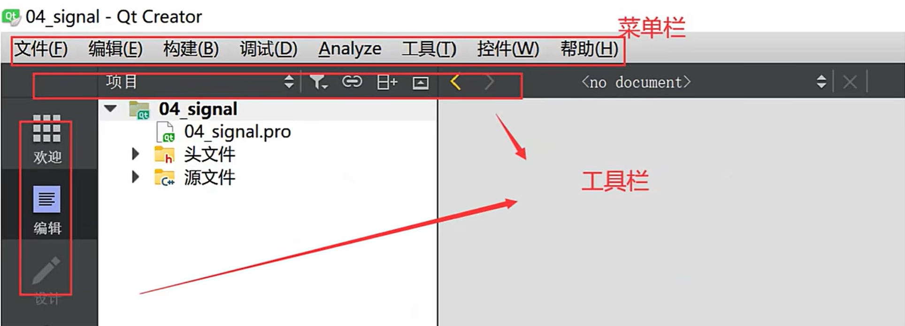

## 十二、QMainWindow概述
- QMainWindow是一个为用户提供主窗口程序的类，包含一个菜单栏（menu bar）、多个工具栏（tool  bars）、多个铆接部件（dock widgets）、一个状态栏（status bar）及一个中心部件（central widget）
-  菜单栏（只能有一个）
    1. 菜单栏类：QMenuBar   
        - 除了new，另一种创建菜单栏的方式：通过QMainWindow类的menuBar()函数==获取主窗口菜单栏指针==
        ```cpp
        QMenuBar *menubar = menuBar();
        ```
    1. 菜单类：QMenu
    2. 菜单项：QAciton
    ```cpp
    #include<QMenuBar>
    
    //创建菜单栏
    QMenuBar *menubar = new QMenuBar;
    this->setMenuBar(menubar);

    //创建菜单
    QMenu *menu1 = new QMenu("文件");
    QMenu *menu2 = new QMenu("编辑");
    QMenu *menu3 = new QMenu("构建");

    menubar->addMenu(menu1);
    menubar->addMenu(menu2);
    menubar->addMenu(menu3);

    //创建菜单项
    QAction *action1 = new QAction("打开文件");
    QAction *action2 = new QAction("另存为");
    QAction *action3 = new QAction("关闭文件");

    menu1->addAction(action1);
    menu1->addAction(action2);
    menu1->addAction(action3);
    ```
- 工具栏（可以有多个）
    1. 工具栏：QToolBar
    2. 工具项：QAction
    ```cpp
    #include<QToolBar>
    
    //创建工具栏
    QToolBar *toolbar = new QToolBar(this);

    //将工具栏添加至窗口,并且让其默认悬浮在左侧
    this->addToolBar(Qt::LeftToolBarArea,toolbar);
    toolbar->addAction(action1);
    toolbar->addAction(action2);
    toolbar->addAction(action3);

    //修改工具栏不可移动（默认可上下左右移动）
    toolbar->setMovable(false);

    //设置停靠区域（可以在窗口的左侧或者右侧）

    toolbar->setAllowedAreas(Qt::LeftToolBarArea|Qt::RightToolBarArea);

    //设置工具栏的浮动状态（默认可悬浮窗口）
    toolbar->setFloatable(false);
   ```
- 状态栏（只能有一个）
    -  状态栏：QStatusBar
        ```cpp
        #include<QStatusBar>
        
        //创建状态栏
        //QStatusBar *statusbar = new QStatusBar(this);
        QStatusBar *statusbar = statusBar();

       this->setStatusBar(statusbar);
        ```
        - 状态栏信息分类
            1. 临时信息
            2. 正式信息（一般在状态栏左侧）
            3. 永久信息（一般在状态栏右侧）
        ```cpp
        #include<QStatusBar>
        
        //创建状态栏
        //QStatusBar *statusbar = new QStatusBar(this);
        QStatusBar *statusbar = statusBar();

  
        this->setStatusBar(statusbar);

  
        //增加临时信息，时间的单位是毫秒
        //statusbar->showMessage("页面显示成功",3000);

  
        //正式信息（一般位于状态栏的左侧）
        QLabel *label1 = new QLabel("打开文件",this);
        QLabel *label2 = new QLabel("www.qf.com");

  
        statusbar->addWidget(label1);

  
        //增加正式信息（一般位于状态栏的右侧）
        statusbar->addPermanentWidget(label2);
        ```
    - ==注意：临时信息会覆盖正式信息==
- 铆接部件（浮动窗口）（可以有多个）
    - 铆接部件：QDockWidget
    ```cpp
    #include<QDockWidget>
    
    //创建铆接部件
    QDockWidget *dockwidget = new QDockWidget("first",this);


    this->addDockWidget(Qt::TopDockWidgetArea,dockwidget);
    ```
- 核心部件（中心部件）（只能有一个）
    - 除了以上部件以外，我们可以创建其他部件作为核心部件
```cpp
#include<QTextEdit>

//创建核心部件
QTextEdit *textedit = new QTextEdit("文本编辑器",this);
    
this->setCentralWidget(textedit);
```
## 十三、资源文件
- Qt资源系统是一个跨平台的资源机制，用于将程序运行时所需要的资源以==二进制==的形式==存储于可执行文件内部==。
- 加载图片：
    - 步骤一：右键工程新增资源文件
    - 步骤二：给资源文件增加前缀，方便寻找
    - 步骤三：给资源文件增加资源
    - 步骤四：起别名（选用），方便使用
    - 示例：
        1. 给菜单项加载图片
        ```cpp
        //给菜单项增加图标信息
        //创建一个图标控件
        QPixmap pix;

  
        //选择图片
        pix.load(":/open");

  
        //给菜单项设置图片
        action1->setIcon(QIcon(pix));
        ```
        2. 增加背景图
        ```cpp
        //窗口重新设置大小
        this->setFixedSize(800,600);

  
        //允许绘制
        this->setAutoFillBackground(true);

  
        //创建图片控件
        QPixmap background = QPixmap(":/open").scaled(this->size(800,600));
        //background.load(":/open");


        QPalette palette;
        palette.setBrush(QPalette::Background,QBrush(background));
        this->setPalette(palette);
        ```
## 十四、UI
- ui功能：绘制界面（通过拖拽控件）
## 十五、对话框QDialog
- 概念：对话框是GUI程序中不可或缺的组成部分。很多不能或者不适合放入主窗口的功能组件都必须放在对话框中设置。对话框通常会是一个顶层窗口，出现在程序最上层，用于实现断案其任务或者简洁的用户交互。
- QDialog（及其子类，以及所有的Qt::Dialog类型的类）对于其parent指针都有额外的解释：==如果parent为NULL，则该对话框会作为一个顶层窗口，否则则作为其父组件的子对话框（此时，其默认出现的位置是parent的中心）。==顶层窗口和非顶层窗口的区别在于：<u>顶层窗口在任务栏会有自己的位置，而非顶层窗口则会共享其父组件的位置。</u>
- 分类：
    -  模态对话框，就是会阻塞同一应用程序中其他窗口的输入
    - 非模态对话框，在显示对话框的同时，其他的界面可以进行输入
## 十六、标准对话框
- 概念：Qt中内置的一系列对话框
## 十七、自定义对话框
- 模态对话框
```cpp
    #include<QDiglog>

    QDialog dialog;
    dialog.setWindowTitle(tr("Hello,Dialog!"));
    dialog.exec();
```
- 非模态对话框
```cpp
    QDialog *dialog = new  QDialog;
    
    //设置自动销毁,有这个不需要手动delete
    dialog->setAttribute(Qt::WA_DeleteOnClose);
    
    dialog->setWindowTitle(tr("Hello,Dialog!"));
    dialog->show();
```
- 注意：
    1. 对话框创建要在堆上创建
    2. 由于对话框的特性==（无parent）==，可以设置对话框关闭，自动销毁对话框
## 十八、文件对话框
- 打开一个文件
```cpp
#include<QDialog>
#include<QFileDialog>

void MainWindow::on_pushButton_clicked()
{
    QString fileName = QFileDialog::getOpenFileName(
            this,
            tr("打开文件"),
            "./",
            tr("Images(*.png *.jpg *.xpm);;Text(*.txt)")
    );
    //参数：父对象指针，文件对话框的标题，打开文件路径，文件过滤器
    if(!fileName.isEmpty()){
            ui->plainTextEdit->appendPlainText(fileName);
    }
}
```
- 打开多个文件
```cpp
#include<QDialog>
#include<QDebug>
#include<QFileDialog>

void MainWindow::on_pushButton_2_clicked()
{
    //多个文件返回QStringList
    QStringList filesName = QFileDialog::getOpenFileNames(
                this,
                tr("打开文件"),
                "./",
                tr("Images(*.png *,jpg);;Text(*.txt)")
                );    
                //参数：父对象指针，文件对话框的标题，打开文件路径，文件过滤器
    for(int i=0;i<filesName.count();i++){
        qDebug()<<filesName.at(i);
    }
}
```
## 十九、颜色对话框
- QColorDialog::getColor()
```cpp
//点击按钮，生成颜色对话框，选择颜色，设置为编辑器字体颜色
#include<QColor>

void MainWindow::on_pushButton_3_clicked()
{
    //获取现有的调色板数据
    QPalette pal = ui->plainTextEdit->palette();

    //现有文字颜色
    QColor iniColor = pal.color(QPalette::Text);
  
    QColor color = QColorDialog::getColor(iniColor,this,"选择颜色");

  
    //判断选择颜色是否有效
    //如果有效，重新设置编辑器的字体颜色
    //如果无效，什么都不做
    if(color.isValid()){
        //设置调色板
        pal.setColor(QPalette::Text,color);
        ui->plainTextEdit->setPalette(pal);
    }
}
```
- 总结：
    1. 颜色对话框的使用参考帮助文档
    2. getColor生成颜色对话框返回值是一个颜色变量，如果在颜色对话框中选择取消，返回值无效，反之有效
## 二十、字体对话框
- QFontDialog::gerFont生成选择字体的对话框
```cpp
void MainWindow::on_pushButton_4_clicked()
{
    bool ok;
    QFont iniFont = ui->plainTextEdit->font();//获取原有的文本框的字体
    QFont font = QFontDialog::getFont(&ok,//&ok是逻辑变量
                                      QFont("Times",12),//默认是Times型号，大小为12
                                      this);

    if(ok){
        //如果ok==true，说明选择字体有效，反之无效
        ui->plainTextEdit->setFont(font);
    }
}
```
- 总结：
    1. 选择字体对话框只用，参考帮助文档
    2. ==getFont生成选择字体对话框，不能通过返回值判断是否有效==，一般是根据getFont的第一个参数==**逻辑变量**==是否为true
## 后续
- 后续内容[[../Qt/Qt（三）]]